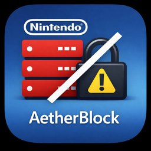

<p align="center">
  
</p>

<h1 align="center">AetherBlock</h1>

<p align="center">
  A Nintendo Switch homebrew app for CFW management.<br>
  DNS blocking, firmware downloads, Atmosphere updates -- all without leaving your Switch.
</p>

<p align="center">
  <a href="https://github.com/hexbyt3/AetherBlock/releases/latest">
    
  </a>
  <a href="https://github.com/hexbyt3/AetherBlock/releases/latest">
    
  </a>
  <a href="https://github.com/hexbyt3/AetherBlock/blob/main/LICENSE">
    
  </a>
  <a href="https://github.com/hexbyt3/AetherBlock/stargazers">
    
  </a>
  <a href="https://github.com/hexbyt3/AetherBlock/actions">
    
  </a>
</p>

---
## Screenshots


## Features

### DNS Hosts Manager
- Toggle Nintendo server blocks on/off with changes applied immediately (no reboot)
- Entries grouped by category: Telemetry, System Updates, Game Content, eShop
- Quick-apply profiles: Block All, Allow Game Updates, Telemetry Only, Allow All
- Built-in connectivity test that TCP pings each host on port 443
- Auto-detects which hosts file to use (emummc > sysmmc > default)
- Atomic file writes to prevent corruption

### Atmosphere Settings Manager
- Toggle verified `system_settings.ini` overrides from a UI (reboot required to apply)
- All settings sourced from Atmosphere's `settings_sd_kvs.cpp` -- nothing unverified
- Categories: Update Suppression, Network, Telemetry, Homebrew
- Preserves existing comments and manual edits in your INI file
- Safe for sysnand online play -- all overrides are local only

### Firmware Manager
- Download Nintendo firmware (HOS) directly from the Switch
- Browse available firmware versions and select the one you need
- Downloads and extracts firmware, then hands off to Daybreak for installation
- No PC required -- download, extract, and install all from the homebrew menu

### CFW Package Updater
- Downloads the latest [CFW4SysBots](https://github.com/hexbyt3/CFW4SysBots) package directly from GitHub
- Includes everything: Atmosphere, Hekate, sys-botbase, ldn_mitm, AetherBlock, and more
- Auto-detects your console type (Mariko/Erista) and downloads the right package
- Preserves your DNS hosts, system settings, sysmodules, and configs during update
- Mod-chipped users just reboot -- no jig, no RCM, no payload injection

## Controls

| Button | Action |
|--------|--------|
| Up/Down | Navigate entries |
| Left/Right | Page up/down |
| A | Toggle / Select / Confirm |
| X | Open profiles menu |
| Y | Save & reload DNS |
| L | Run server connectivity test |
| R | Atmosphere settings |
| ZL | Firmware Manager |
| ZR | CFW Package Updater |
| - | Seed default Nintendo entries |
| + | Quit (with unsaved changes check) |

## Installation

1. Download `AetherBlock.zip` from the [latest release](https://github.com/hexbyt3/AetherBlock/releases/latest)
2. Extract to the root of your SD card (places the NRO in `/switch/AetherBlock/`)
3. Make sure Daybreak is at `/switch/daybreak.nro` for firmware installation
4. Launch from the Homebrew Menu

Or grab the full CFW package from [CFW4SysBots](https://github.com/hexbyt3/CFW4SysBots) which includes AetherBlock, Daybreak, and everything else you need.

## Updating Your Switch

You can update both CFW and firmware in one session with a single reboot at the end.

### Step 1: Update CFW Package
1. Open AetherBlock from the Homebrew Menu
2. Press **ZR** to open the CFW Package Updater
3. Press **A** to check for updates, then **A** again to download and install
4. **Don't reboot yet** — the new files are on your SD card and will take effect on the next boot

### Step 2: Update Nintendo Firmware (if needed)
1. Press **B** to go back, then press **ZL** to open the Firmware Manager
2. Press **A** to fetch the firmware list
3. Select the firmware version you want and press **A** to download
4. When extraction finishes, press **A** to launch Daybreak
5. Daybreak opens with the firmware ready — confirm the install
6. **Reboot once** — the new Atmosphere and new firmware both take effect

### Why CFW First?

Atmosphere must be updated before the reboot that loads the new firmware. New Atmosphere releases add support for new Nintendo firmware versions. If only the firmware is updated and the old Atmosphere is still on the SD card when the Switch reboots, it won't be able to boot into CFW.

Extracting the CFW package just places files on the SD card — it doesn't affect the currently running system. The old Atmosphere keeps running in memory while you do everything. The new files only matter at boot, which is why you can do both steps back to back and reboot once at the end.

## Building

Requires [devkitPro](https://devkitpro.org/) with the following packages:

```bash
(dkp-)pacman -S switch-dev switch-sdl2 switch-sdl2_ttf switch-freetype switch-curl switch-mbedtls switch-zlib
make
```

## How It Works

**DNS Hosts:** Reads and modifies Atmosphere's hosts file at `/atmosphere/hosts/default.txt`. Entries prefixed with `;` are disabled. After saving, it calls Atmosphere's IPC command 65000 on `sfdnsres` to reload the hosts file in memory -- no reboot needed.

**System Settings:** Reads and modifies `/atmosphere/config/system_settings.ini`. Atmosphere parses this file at boot and overrides the corresponding system settings via its set:sys mitm service. Changes here require a reboot to take effect.

**Firmware Manager:** Fetches a firmware manifest from the CFW4SysBots repo, downloads the selected firmware ZIP, extracts it to `/firmware/`, then chain-loads Daybreak with the firmware path pre-set. Daybreak handles the actual firmware flash.

**CFW Package Updater:** Hits the GitHub API for the latest CFW4SysBots release, auto-selects the right package for your console (mod-chipped or unpatched), and downloads/extracts the full CFW bundle. Your hosts files, system settings, sysmodules, and AetherBlock config are preserved during extraction.

## Credits

- DNS reload mechanism via [DNS-MITM_Manager](https://github.com/znxDomain/DNS-MITM_Manager) by znxDomain
- Server list from [NintendoClients Wiki](https://github.com/kinnay/NintendoClients/wiki/Server-List)
- Download/extraction patterns adapted from [AIO-Switch-Updater](https://github.com/HamletDuFromage/aio-switch-updater)
- Settings verified against [Atmosphere](https://github.com/Atmosphere-NX/Atmosphere) source (`settings_sd_kvs.cpp`)
- Built with [libnx](https://github.com/switchbrew/libnx), [SDL2](https://www.libsdl.org/), [cJSON](https://github.com/DaveGamble/cJSON), and [libcurl](https://curl.se/libcurl/)

## License

MIT
